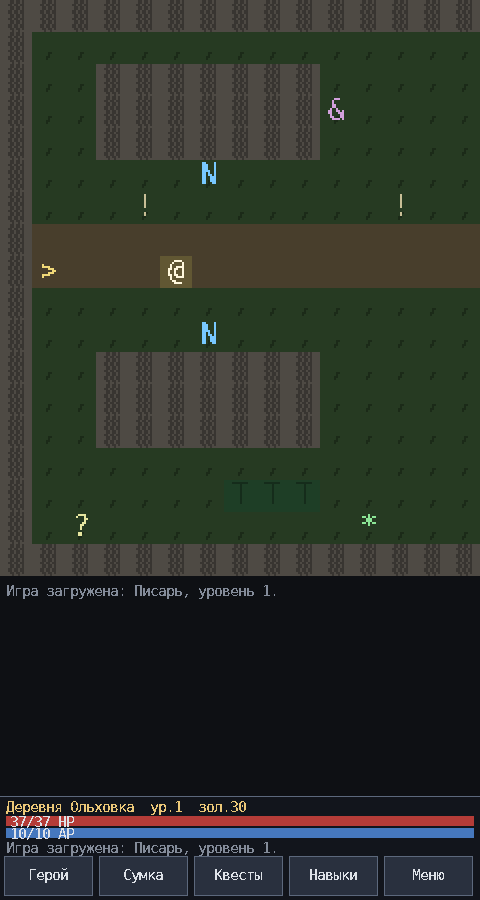
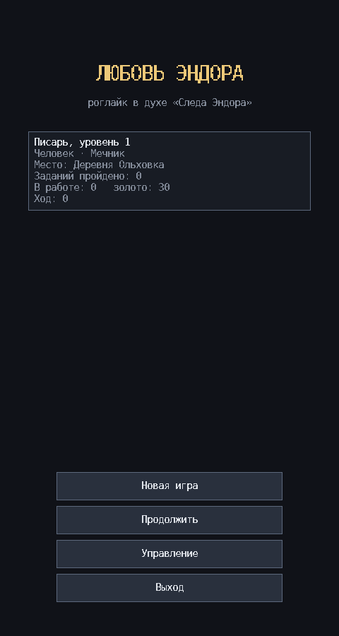
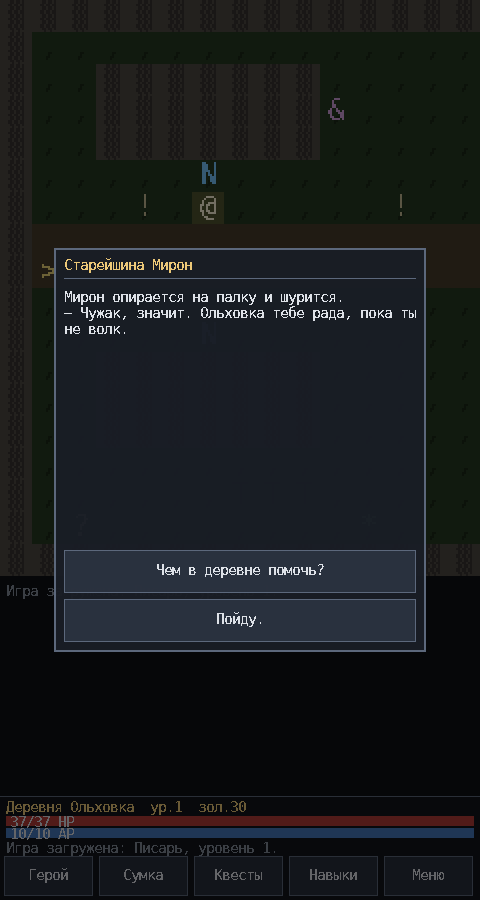
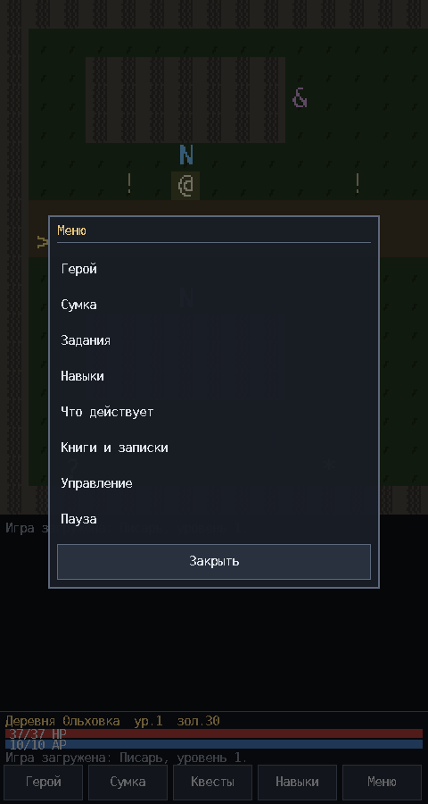

# Любовь Эндора

Пошаговая RPG на C++11. Вдохновлена **Andor's Trail** («След Эндора»):
тайловый мир, пошаговый бой на очках действия, квесты через диалоги, торговцы
и снаряжение. Это не клон — боевая механика своя (стойки и кураж), и мир свой.

Две оболочки поверх одной логики: **терминальная** (без зависимостей, ANSI)
и **графическая** на SDL2 (касания, окна, цвет). Обе гоняют один и тот же
код игры и одни и те же тесты.

| Графическая | Терминальная |
|---|---|
|  | <pre>+----------------------------+<br>&#124;#,,####,,,,,,,,,,,####,,,,,#&#124;<br>&#124;#,,,,,N,,,,,,,,,,,,,,B,,,,,#&#124;<br>&#124;#,,,,,,,,,!,,,,,,,,,,,,,,,,#&#124;<br>&#124;#==========================#&#124;<br>&#124;#@========================>#&#124;<br>&#124;#,,,,,,,,,,,,,,,,,,,,,,,!,,#&#124;<br>&#124;#,,,,,X,,,,,~~~~~,,,,,L,,,,#&#124;<br>+----------------------------+</pre> |

<p>



</p>

Главное меню, разговор и внутриигровое меню по тапу. Всё, кроме главного
меню, — полупрозрачные окна поверх мира.

## Управление

### Касанием (графическая сборка)

Ходьбой правит не жест, а **лежащий палец**: куда показываешь, туда герой и
идёт, пока не уберёшь руку. Свайпать для этого не нужно — свайп остался
прокруткой в окнах.

| Жест | Действие |
|---|---|
| **Палец на поле** | идти к точке под пальцем, пока палец лежит |
| **Вести пальцем** | цель едет следом: герой поворачивает за ней |
| **Держать дольше 0,7 с** | перейти на бег |
| **Тап по полю** | идти к точке и после того, как палец убрали, — пока не дойдёшь или не упрёшься |
| **Тап на ходу по себе или в стену** | остановиться |
| **Тап по себе или в стену, стоя** | внутриигровое меню |
| **Тап по пункту** | выбрать (одним касанием) |
| **Свайп в окне** | прокрутка списка или текста |
| **Тап мимо окна** | закрыть окно |

Темп — четыре клетки в секунду шагом, семь бегом — отмеряется часами, а не
кадрами: на быстром телефоне герой идёт ровно так же, как на медленном, и
за один кадр делает не больше шага.

Поиска пути нет намеренно, и обещание игроку выполняется буквально: герой
идёт **в сторону** точки — сперва по оси с большей разницей, потом по второй.
Этого хватает, чтобы обойти угол; в тупик он не пойдёт, а упрётся и встанет.
Ходьба доводит начатое до конца: упёршись в жителя, заводит разговор.

### Клавишами (обе сборки)

| Клавиша | Действие |
|---|---|
| Стрелки или `WASD` | идти; шаг в NPC — разговор, в моба — бой |
| `C` `I` `Q` `K` | герой · сумка · задания · навыки |
| `F` `P` `B` | действующие эффекты · порталы · библиотека |
| `M` | меню: сохранить, загрузить, выйти |
| `Q` или `0` | назад из любого списка (в терминале) |
| `1` `2` `3` | стойка: осторожная · ровная · яростная |
| `?` | справка |

**Escape нигде не требуется.** Меню открывается по `M`, назад из списка —
`Q` или `0`. Это сделано ради экранной клавиатуры Android, где Escape
приходится набирать сочетанием клавиш. Если Escape есть — он тоже работает,
как и кнопка «Назад» на телефоне.

**В бою:** `A` атака · `P` мощный удар · `U` предмет · `E` закончить ход ·
`F` бежать · `1`/`2`/`3` сменить стойку (раз за раунд). В графической
сборке то же самое — кнопками.

Знаки карты: `@` ты · `N` житель · `X` враг · `>` переход · `!` табличка ·
`*` предмет · `?` записка · `&` лежанка · `C` сундук · `O` твой портал ·
`#` стена · `T` дерево · `~` вода · `.,=` земля.

Все враги обозначены одним знаком, все жители — другим: уникальный символ на
каждое существо не масштабируется, когда контента становится много. Кто перед
тобой, видно по имени в диалоге и в окне боя. Символы собраны в `namespace
glyph` в [`src/types.h`](src/types.h) — поменять можно одной строкой.

## История

Проект начинался как прототип `andor.cpp` (193 строки). Его разбор —
в [`REVIEW.md`](REVIEW.md): 3 блокера сборки, 5 дефектов памяти, 4 логических
бага. Нынешний движок написан заново по выводам этого ревью: файловый
ввод-вывод на `<fstream>`, инициализация по одному полю на строку, геометрия
отдельно от объектов, платформозависимый код за одним интерфейсом, тесты и
сборка без предупреждений. Сам прототип остался в истории git.

## Чем отличается от «Следа Эндора»

В Andor's Trail атака — это шаг в монстра, и весь выбор игрока сводится к
«бить или отойти». Здесь бой вынесен на отдельный экран, и каждый раунд
требует решения:

**Стойки.** Меняются в бою, но не чаще раза за раунд, — то есть выбор нужно
делать заранее, а не подстраиваться после чужого удара.

| Стойка | Эффект |
|---|---|
| Осторожная | +15 блок, +2 броня, −20 меткость, урон 70% |
| Ровная | без модификаторов |
| Яростная | +15 меткость, урон 140%, −15 блок, −2 броня |

**Кураж.** Каждый попавший удар копит кураж (до 5). Пропущенный удар его
сбивает. За 3 кураж уходит в **мощный удар**: бьёт наверняка, двойным уроном
и игнорируя половину брони. Из-за этого выгодно не просто бить, а держать
серию — и не подставляться, когда серия набрана.

Против волка, который бьёт часто и слабо, окупается яростная стойка. Против
вожака и разбойника, бьющих тяжело, — осторожная: переждать и накопить.

## Что уже есть

- **Пятьдесят локаций** в шести регионах — весь план лорной карты:

  | Регион | Уровни | Локации |
  |---|---|---|
  | Ольховый лоскут | 1–8 | Ольховка, лес, Барсучья пещера, Развалины заставы, Ольховский погост, Гнилая топь, Святилище Нулевой точки, скрытый Схрон Ордена |
  | Шов | 8–14 | Козья тропа, Стеклянное поле, Рынок Шва, Мельница на Тихой, Соляные шахты, Пустой караван-сарай, Хутор Двоеданный, Подвесной мост в никуда |
  | Половины | 14–20 | Половина Города, Улица без конца, Литейный двор, Канал Мёртвой воды, Башня Счетовода, Городской архив |
  | Орден | 20–28 | Ворота Ордена, Привратная, Библиотека, Чертёжный зал, Кельи, Печь, Зал Отказа, Узел Второй, Узел Третий, Могила Первого Мастера |
  | Дрейф | 28–36 | Дрейфующий луг, Дом на отшибе, Колодец Двух Вёдер, Роща, где не темнеет, Поле после битвы, Вторая Половина Города, Лестница вверх, Край Лоскута, Пустая Ольховка, Тропа Возвращения |
  | Изнанка | 36–45 | Первый Шов, Галерея Линий, Комната Измерений, Встреча, Узел Первый, Сердце Стяжения, Точка Ноль, Развязка |

  Граф переходов двусторонний и проверяется тестом.
- **Две оболочки.** Терминальная — без зависимостей, где угодно. Графическая
  на SDL2 — под телефон: цветная карта с камерой за героем, полупрозрачные
  окна, кнопки под палец, вшитый растровый шрифт с кириллицей (никакого
  SDL_ttf и внешних файлов).
- **Три развязки.** В Развязке лежит лист с тремя исходами: дотянуть сеть
  до конца, разрезать её или удержать как есть. Выбор делается один раз,
  записывается в мир и переживает сохранение; два других ответа исчезают
  навсегда, и собеседник дальше говорит только о сделанном. Каждый исход
  показывается отдельным экраном-эпилогом. Правильного нет: каждый
  что-то ломает.
- **Пятьдесят четыре квеста**, из них девятнадцать **тайных**: их никто не выдаёт,
  они открываются событием — находкой записки, добычей предмета, входом в место,
  убийством. Есть квесты **без правильного ответа**: на Хуторе Двоеданном два
  Прохора, оба настоящие, а в Зале Отказа надо сказать, кто был прав — Первый
  Мастер или Совет; второй раз ответ не переписать. Финальный — тот же,
  но про весь мир сразу.
  Все проходимы — это проверяет тест, который проходит их настоящим боем от
  первого разговора до последней награды.
- **Запертые проходы.** Условием может быть ключ, этап квеста, счётчик убийств
  или всё сразу. Схрон Ордена закрыт и ключом со стража, и разгадкой: без
  найденной записки дверь не пустит даже с ключом, и о самой локации игрок не
  узнает. Козья тропа открывается только разговором, нижний затвор мельницы —
  ключом. Ключ никогда не тратится: потеряв его, нельзя запереть себя снаружи;
  и ключ-кольцо открывает свою дверь, даже когда надето, а не лежит в сумке.
  В Дрейф ведут ровно два прохода, и оба — знание, а не вещь: разрыв Третьего
  узла пускает того, кто прочёл отметку, а Тропа Возвращения открывается со
  стороны святилища лишь тому, кто уже прошёл по ней в другую сторону.
- **Мир и его история.** Всё связано одной идеей — Стяжением, — и лор не
  выдаётся лекциями, а находится в 61 записке. См.
  [`docs/lore.md`](docs/lore.md): история мира, пятьдесят локаций, три развязки
  и план контента.
- **Герой:** 5 рас и 5 специализаций, выбираются при создании и складываются
  в итоговые характеристики. Все 25 сочетаний проверяются тестом.
- **Бой:** очки действия, меткость против блока, броня, криты, стойки, кураж,
  бегство, расходники прямо в бою.
- **Эффекты и их таймер:** яд, кровотечение, горение, регенерация, сила,
  стойкость, скорость, слабость, оцепенение, прозрение. Тикают и в бою, и на
  ходу мира. Накладываются ударами врагов, зачарованиями и зельями; снимаются
  противоядием и отдыхом.
- **Зачарования:** 5 рун на снаряжение, за золото и реагент. Одна вещь — одна
  руна, снять нельзя. Руна оружия срабатывает на попадании.
- **Порталы:** после квеста «Мастер нулевой точки» герой ставит до четырёх
  порталов; шаг на портал ведёт к следующему, с двумя это связка туда-обратно.
- **Сундуки:** на карте, часть заперта и требует ключа. Вскрываются один раз.
- **Книги и записки.** После квеста «Слово и бумага» Гурий возит чистые книги.
  Книгу можно назвать и писать в неё построчно — встроенный редактор работает
  только буквами, цифрами, Enter и Backspace, без управляющих клавиш; в
  графической сборке то же самое кнопками, и на Android поднимается экранная
  клавиатура. По миру разбросаны записки: часть — находки и пасхалки, часть
  нужна по квестам. Найденное складывается в ту же библиотеку, но только для
  чтения. Всё это входит в сохранение вместе с остальным.
- **Инвентарь мобов:** добыча разыгрывается при появлении моба, а не при
  смерти — моб реально несёт то, что с него упадёт, и подбирает вещи с земли.
- **Прокачка:** опыт, уровни, 7 навыков по 5 рангов, очки навыка за уровень.
- **Снаряжение:** 5 слотов, больше 30 предметов.
- **Торговля:** 3 магазина со своими наценками, вкладки покупки и продажи.
  Квестовые предметы продать нельзя.
- **Диалоги:** узлы и варианты ответа описаны данными, с условиями по этапу
  двух квестов сразу, счётчикам убийств и предметам в сумке.
- **Мир живёт:** зоны спавна пополняются по таймеру респавна, а мобы ведут
  себя по трём состояниям:
  - **покой** — бродят внутри своей зоны спавна и не покидают её;
  - **преследование** — начинается, только когда моб *видит* игрока: и по
    расстоянию, и по прямой линии. Сквозь стену или заросли он не заметит
    никого;
  - **возврат** — потеряв игрока из виду, моб идёт назад в свою зону и там
    успокаивается.

  Видимость считается целочисленным Брезенхэмом, поэтому результат одинаков
  на любой платформе. Вода взгляд пропускает, стены и деревья — нет.
- **Сохранение** в текстовый файл `hero.sav` (формат версии 3). Обе оболочки
  пишут его в один и тот же каталог, так что партию можно продолжить в другой.
  Графическая сборка вдобавок сохраняется сама, когда Android уводит её в фон.

## Формат карты

Локации лежат в `data/maps/<id>.map`. Сетка хранит **только геометрию** —
проходимо или нет. Всё остальное описано объектами со своими координатами:
у телепорта есть цель, у предмета — количество, у зоны спавна — радиус и
лимит. Один символ на клетку такого не вместил бы.

```
name Деревня Ольховка
size 48 18
grid
################################################
#,,,,,,,,,,,,,,,,,,,,,,,,,,,,,,,,,,,,,,,,,,,,,#
... ровно 18 строк ровно по 48 символов ...
objects
npc   6  5  elder                 ; NPC из базы контента
item  11 16 bread 2               ; предмет и количество
exit  46 8  forest 2 8            ; переход: локация и координаты прибытия
spawn 20 15 rat 2 4               ; зона: враг, лимит, радиус
bed   10 3                        ; лежанка, восстанавливает силы
chest 34 12 300 rusty_key plate_armor:1 rune_stone:1
                                  ; золото, ключ ("-" если открыт), содержимое
note  12 3  ink                   ; записка из базы контента
sign  12 6  Текст таблички        ; текст до конца строки
end
```

Карты можно править руками, скриптом `tools/gen_maps.py` или редактором
[True Joint Tile Maker](https://github.com/dpsmpx/TrueJointTileMaker): у него
есть режим локаций, работающий с этим форматом напрямую. Совместимость сверена
с обеих сторон — коды клеток и виды объектов совпадают с `src/world.cpp`, и все
пятьдесят карт проходят через его разбор и обратную запись байт в байт.

Символы сетки: `.` пол, `,` трава, `=` дорога (проходимы); `#` стена,
`~` вода, `T` дерево (нет). Неизвестный символ считается стеной. Парсер
проверяет ширину каждой строки и сообщает номер строки при ошибке.

Карты собираются скриптом `tools/gen_maps.py`: он строит рельеф
прямоугольниками (ширина строки верна по построению) и проверяет, что вся
локация связна, объекты стоят на проходимых клетках, а переходы ведут в
существующие локации на достижимые клетки. После правки карт:

```bash
python3 tools/gen_maps.py && make embed && make
```

## Устройство проекта

```
ЛОГИКА — общая для обеих оболочек
src/types.*      тайлы, характеристики, предметы, стойки, работа с UTF-8
src/rng.h        детерминированный xorshift64*, состояние входит в сохранение
src/content.*    база: предметы, враги, навыки, квесты, магазины, диалоги
src/world.*      разбор карт, объекты локации
src/game.*       состояние, перемещение, бой, прокачка, торговля, квесты
src/save.cpp     сохранение и загрузка
src/paths.*      где искать карты и куда писать сохранения
src/embedded_maps.cpp  карты, вшитые в бинарник (генерируется: make embed)

ТЕРМИНАЛЬНАЯ ОБОЛОЧКА
src/platform.*   ввод и экран: termios на POSIX, conio/WinAPI на Windows
src/ui.*         отрисовка и экраны
src/main.cpp     главное меню и игровой цикл

ГРАФИЧЕСКАЯ ОБОЛОЧКА
src/gfx/font.*        вшитый растровый шрифт и разбор UTF-8
src/gfx/font_data.cpp растр шрифта (генерируется: make font)
src/gfx/draw.*        SDL2: прямоугольники, рамки, текст
src/gfx/touch.*       распознавание жестов, без SDL — проверяется тестами
src/gfx/walk.*        ходьба по тапу, без SDL — проверяется тестами
src/gfx/png.*         свой кодек PNG, без SDL — проверяется тестами
src/gfx/tiles.*       формат листа тайлов и вид по умолчанию, без SDL
src/gfx/tileset.*     лист тайлов на видеокарте
src/gfx/gui.*         виджеты: панель, кнопка, список, абзац
src/gfx/app.*         цикл, карта, ввод
src/gfx/screens.cpp   HUD, меню, создание героя, бой
src/gfx/modals.cpp    всплывающие окна
src/gfx/main_gfx.cpp  точка входа

ОСТАЛЬНОЕ
data/maps/       карты
data/tiles/      графика карты: по картинке на тайл (docs/tiles.md)
tools/           генераторы карт и шрифта
tests/           регрессионные тесты
docs/lore.md     мир, история, план контента на 50 локаций
docs/gui.md      графическая оболочка: жесты, окна, шрифт, проверка без экрана
docs/tiles.md    как нарисовать свою графику карты
docs/design.md   исходный дизайн-документ
docs/android.md  как собрать и играть на Android
REVIEW.md        ревью прототипа, с которого всё начиналось
```

Логика не знает ни про терминал, ни про SDL: обе оболочки вызывают один и тот
же `Game`. Поэтому переход на графику не сдвинул в мире ничего — сквозное
прохождение всех пятидесяти четырёх квестов проходит как проходило.

## Как это проверяется

`make test` — 3732 проверки в одном бинарнике. Кроме обычных модульных, там:

- **сквозное прохождение**: тест играет всю игру настоящим боем и настоящими
  шагами, от первого волка до последнего выбора, и закрывает все 54 квеста;
- **целостность контента**: каждая ссылка из диалога, добычи, сундука или
  зоны спавна разрешается в существующий предмет, врага, узел или квест;
- **связность мира**: все 50 локаций достижимы из деревни, из каждой есть
  обратный путь, ни один объект не стоит в стене;
- **покрытие шрифта**: каждый символ, который игра умеет напечатать, в шрифте
  есть — дыру в тексте должен находить тест, а не игрок;
- **PNG и тайлы**: чужой PNG с динамическими кодами Хаффмана читается пиксель
  в пиксель, свой пишется и читается обратно без потерь, мусор отвергается с
  причиной; графика пишется и читается по файлу на тайл, испорченный файл
  называет себя и не отменяет остальные, и ни один слот не занят дважды;
- **жесты и ходьба**: тап, порог свайпа, состояние пальца, два пальца; ходьба
  доходит, упирается, бежит быстрее и прерывается разговором, а её темп
  не зависит от частоты кадров — двадцать кадров в секунду и двести дают
  одно и то же число шагов.

Рисование так не проверить, поэтому у графической сборки есть прогон по
сценарию: `./andors-love-gui --script сценарий.txt каталог` проигрывает
касания через тот же распознаватель, что и живой палец, и сохраняет кадры.
Снимки в этом README сняты именно так — на машине без дисплея.
Подробности в [`docs/gui.md`](docs/gui.md).

## Что дальше

Мир доведён до конца: все шесть регионов лорной карты построены, все
пятьдесят запланированных локаций на месте, и у игры есть развязка.

Из дизайн-документа не реализовано: торговля предметами между мобами,
ставящиеся игроком таблички. Из технического — несколько ячеек сохранения
и отдельная запись пройденных развязок, чтобы игра помнила все три.

Поиск пути намеренно не делается ни для мобов, ни для героя: шаг идёт по оси
с большей разницей, а если упирается — пробует вторую. Этого хватает, чтобы
обойти угол, а дальше работает возврат в зону.

## Сборка и запуск

Нужен компилятор с C++11 (g++ 4.8+ / clang 3.3+ / MSVC 2015+) и `make`.
Собирается и более новыми стандартами: `make CXXSTD=-std=c++17`.

```bash
make              # терминальная сборка, без зависимостей
./andors-love     # запускать ИЗ КОРНЯ проекта — карты ищутся в data/maps

make gui          # графическая сборка, нужен SDL2 (хватает 2.0.0)
./andors-love-gui

make gui-so       # то же для Android: библиотека для SDL-активности
```

Карту можно перерисовать своей графикой — см. [`docs/tiles.md`](docs/tiles.md):

```bash
./andors-love-gui --export-tiles data/tiles   # выгрузить текущий вид
```

Получится семнадцать обычных PNG — `wall.png`, `grass.png` и так далее. Их
открывает и сохраняет редактор
[True Joint Tile Maker](https://github.com/dpsmpx/TrueJointTileMaker), так что
между «нарисовал» и «увидел в игре» нет ни одного преобразования.
Ненарисованный тайл продолжает выглядеть как раньше, поэтому набор можно
делать по одному файлу. Тем же редактором правятся и карты локаций.

Карты вшиты в бинарник, так что обе сборки работают и в одиночку, без
каталога `data/`. Каталог сохранений выбирается сам и одинаково в обеих
оболочках: `$ANDORS_LOVE_SAVE`, затем `saves/`, затем `$HOME/.andors-love`,
затем рядом с бинарником, затем `$TMPDIR` — первый, куда удаётся записать.

Другие цели:

```bash
make run      # собрать и сразу запустить
make test     # 3732 регрессионных проверки
make debug    # сборка с ASan + UBSan
make font     # перегенерировать вшитый шрифт (нужен python3-pil)
make gui-so   # графика для Android: libandors-love-gui.so
make embed    # перевшить карты после правки data/maps
make clean
```

Сборка идёт с `-Wall -Wextra` и проходит без предупреждений. Стандарт языка
вынесен в отдельную переменную `CXXSTD`, поэтому свой `CXXFLAGS` в окружении
не может его случайно унести.

Игра ищет карты в `data/maps`: сначала по `ANDORS_LOVE_DATA`, затем в текущем
каталоге, затем рядом с исполняемым файлом. Если файлов нет нигде, берётся
копия, вшитая в бинарник, — поэтому игра работает и одним файлом, без
каталога с данными (нужно для сборки APK). После правки карт обновите копию:
`make embed`.

Каталог сохранений выбирается так же по очереди: `ANDORS_LOVE_SAVE`, `saves/`
в рабочем каталоге, `$HOME/.andors-love`, `saves/` рядом с бинарником,
`$TMPDIR/andors-love` — первый, куда удаётся записать.

**На Windows** — MSYS2, окружение UCRT64:

```bash
pacman -S --needed mingw-w64-ucrt-x86_64-gcc mingw-w64-ucrt-x86_64-make \
                   mingw-w64-ucrt-x86_64-SDL2
mingw32-make gui
./andors-love-gui.exe
```

Makefile сам видит, что компилятор целится в Windows (по `-dumpmachine`), и
подстраивается: не передаёт `-rdynamic` — это флаг компоновщика ELF, MinGW о
нём не знает и падает с `unrecognized command-line option`; точку входа там
разворачивает библиотека `SDL2main`, которую подставляет `sdl2-config`. Заодно
к именам целей дописывается `.exe`, иначе make не находит собранный файл и
пересобирает его каждый раз.

Готовый `.exe` тянет за собой библиотеки из `ucrt64/bin`. Чтобы он запускался
и вне MSYS-оболочки, соберите рантайм внутрь и положите рядом `SDL2.dll`:

```bash
mingw32-make gui LDFLAGS="-static-libgcc -static-libstdc++"
cp /ucrt64/bin/SDL2.dll .
```

Терминальная сборка (`mingw32-make`) там тоже работает: ввод идёт через
`conio`, вывод — через ANSI-последовательности Windows 10 и консоль,
переключённую в UTF-8.

**На смартфоне** (Termux или C4Droid) — см. [`docs/android.md`](docs/android.md).
Интерфейс подстраивается под ширину терминала: от 28 колонок и выше.

###### **Активно использовался Claude Code Ultracode**
